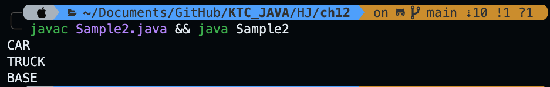
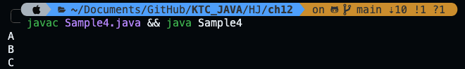
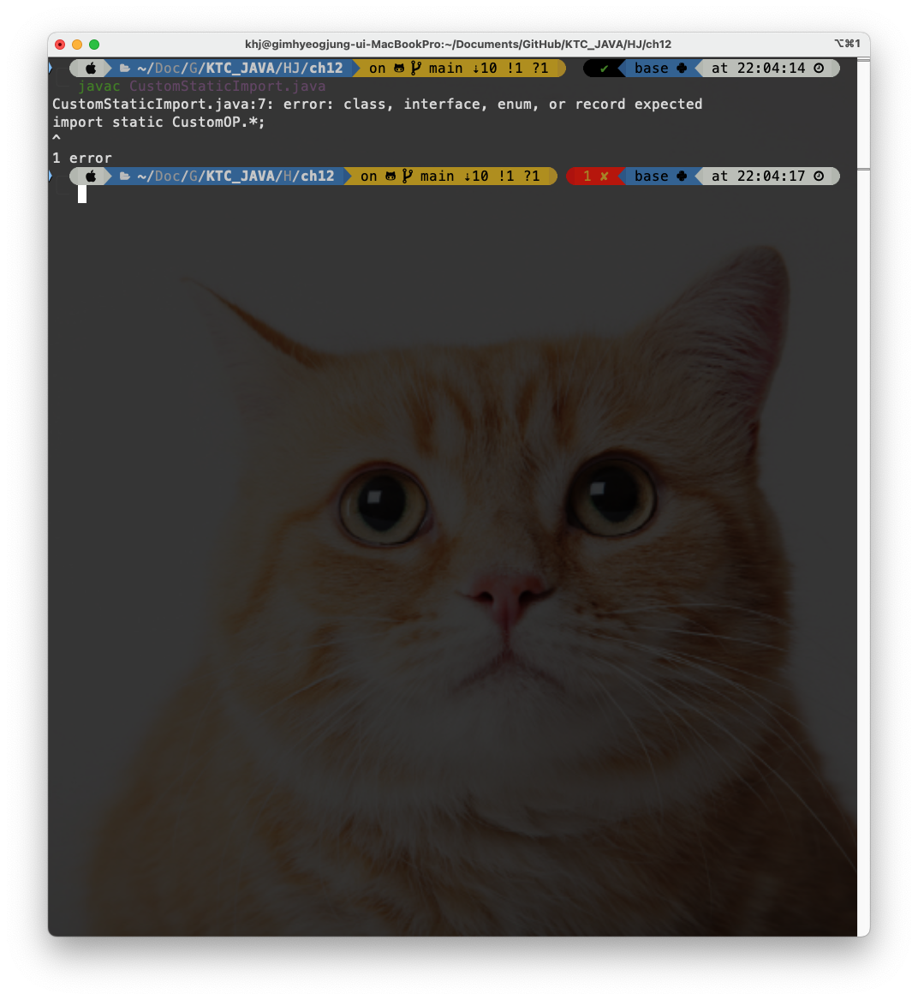

# Chapter 12: Enumerations, Autoboxing, Static Import, and Annotations

## 요약
1. enums : 특정한 값을 가지는 새로운 데이터 타입을 정의할 수 있도록 함.
2. autoboxing : 기본형과 객체형 간의 변환을 자동화 함.
3. static import : 정적 멤버를 더 간편하게 사용할 수 있게 함.
4. anotation : 소스코드에 추가적인 정보를 삽입할 수 있도록 함.

## 1. enumeration

> 열거형은 정해진 개수의 상수 값을 갖는 새로운 데이터 타입이다.
> 이전에는 final 상수로 정의했었음.

### 사용법
```java
enum Transport {
   CAR, TRUCK, AIRPLANE, TRAIN, BOAT
}
```

> 위 상수들은 자동으로 public static final 속성을 갖는다.

### 사용예시
```java
class sample {
   public static void main(String[] args) {
      enum Transport {
         CAR, Truck, AIRPLANE, TRIAN, BOAT 
      }

      Transport tp = Transport.CAR;

      if(tp == Transport.CAR) {
         System.out.println("It's car");
      }
   }
}
```

> int 형 값에 넣을 수는 없음 (c++과 차이가 있음), 타입이 Transport여야 함, 선언 및 초기화를 해야함

> 대문자로 하는 것이 컨벤션임

### 열거형 내장 메서드

1. values() 메서드
```java
public class Sample2 {
   public static void main(String[] args) {
      enum Transport {
         CAR, TRUCK, BASE
      }
      
      for(Transport t: Transport.values()) {
         System.out.println(t);
      }
   }
}
```



> values() 메서드를 통해서 모든 상수를 배열로 반환할 수 있음


### valueOf(Stirng name)
```java
public class Sample3 {
   public static void main(String[] args) {
      enum Transport {
         AIR
      }

      Transport tp = Transport.valueOf("AIR");
      System.out.println(tp);
   }   
}
```

> 이건 왜 사용하는 지는 모르겠음
> AIR가 열거형 Transport에 있는 경우 valueOf를 통해 열거형을 가져올 수 있음
> 전달하는 건 문자열
> 열거형에 AIR가 없으면 에러 발생함

### 열거형의 고급기능

1. 열거형의 생성자, 메서드, 인스턴스 변수 활용
```java
public class Sample4 {
   public static void main(String[] args) {
      enum Transport {
         A(1), B(2), C(3);
         
         private int speed;

         Transport(int s) {
            speed = s;
         }

         int getSpeed() {
            return speed;
         }
      }

      Transport tp = Transport.A;
      System.out.println(tp);
   }
}
```

> 열거형 원소들을 지정할 때 값들을 결정할 생성자를 정의할 수 있음

```java
public class Sample4 {
   public static void main(String[] args) {
      enum Transport {
         A(1), B(2), C(3);
         
         private int speed;

         Transport(int s) {
            speed = s;
         }

         int getSpeed() {
            return speed;
         }
      }

      for(Transport t: Transport.values()) {
         System.out.println(t);
      }
   }
}
```


### 열거형의 제약사항
1. 상속이 불가능 하다 (모든 열거형은 java.lang.Enum class를 자동으로 상속받음)
2. 다른 클래스가 열거형을 확장할 수 없다.


### java.lang.Enum 클래스의 ordinal, compareTo메서드
1. ordinal을 통해 열거형에서의 순서를 얻을 수 있다.
```java
public class Sample4 {
   public static void main(String[] args) {
      enum Transport {
         A(1), B(2), C(3);
         
         private int speed;

         Transport(int s) {
            speed = s;
         }

         int getSpeed() {
            return speed;
         }
      }

      System.out.println(Transport.A.ordinal());
      System.out.println(Transport.B.ordinal());
      System.out.println(Transport.C.ordinal());
   }
}
```


```java
public class Sample5 {
   public static void main(String[] args) {
      enum Transport {
         A(1), B(2), C(3);
         
         private int speed;

         Transport(int s) {
            speed = s;
         }

         int getSpeed() {
            return speed;
         }
      }

      if(Transport.A.compareTo(Transport.B) < 0) {
         System.out.println("B is before A");
      }
   }
}
```


### autoboxing and Auto-unboxing

#### autoboxing이란
primitive type 을 wrapper class로 변환을 자동으로 수행하는 기능이다.
> int -> Integer -> double

#### auto-unboxing이란
wrapper class object 를 primitive type으로 ㅈ다오 변환하는 과정이다.

> Integer -> int -> double


### primitive, Wrapper class Type
1. ArrayList에 값을 저장할 경우(용례)

### auto-boxing, auto-unboxing 예시
```java
public class Sample6 {
   public static void main(String[] args) {
      Integer iOB = 100;
      int i = iOB;
      
      System.out.println(i + " " + iOB);
   }
}
```


> auto-boxing과 auto-unboxing은 매개변수와 반환값에서도 자동으로 수행된다.

```java
public class Sample7 {
   static int showValue(Integer v) {
      return v;
   }
   public static void main(String[] args) {
      Integer iOb = 1;
      System.out.println(showValue(iOb));
   }
}
```


> 연산식 내부에서도 오토박싱과 오토언박싱이 작동한다.

```java
public class Sample8 {
   public static void main(String[] args) {
      Integer A = 1, B = 2;
      int C = A + B;

      System.out.println(C);
   }   
}
```


### 오토박싱과 오토언박싱의 성능
오토박싱과 오토언박싱은 편리하지만 성능 오버헤드가 발생할 수 있다.

> 책에서는 그냥 기본형을 사용하는 것이 더 낫다고 언급되어 있음

### ArrayList에서 오토박싱과 오토언박싱 사용하기
```java
import java.util.ArrayList;

public class Sample9 {
   public static void main(String[] args) {
      ArrayList<Integer> numList = new ArrayList<>();

      numList.add(10);
      numList.add(10);

      int value = numList.get(0);
      System.out.println(value);
   }
}
```


### Static import
> Static import는 특정 클래스나 인터페이스의 정적멤버(static member)를 직접 이름만으로 사용할 수 있도록 해주는 기능이다. 이는 코드를 더 간결하게 만들고 가독성을 높일 수 있다는 장점이 있음


#### 정적 임포트를 사용한 경우
```java
import static java.lang.Math.sqrt;

public class StaticImport {
   public static void main(String[] args) {
      double a = sqrt(10);
      System.out.println(a);
   }
}
```


#### 정적 임포트에서 와일드카드 사용
```java
import static java.lang.Math.*;

public class StaticImport {
   public static void main(String[] args) {
      double a = sqrt(10);
      System.out.println(pow(a, 3));
   }
}
```


### 같은 파일에 있는 경우 static import 는 불가능 하다.
```java
class CustomOP {
   public static int getArithmaticAverage(int a, int b) {
      return (a + b) / 2;
   }
}

import static CustomOP.*;


public class CustomStaticImport {
   public static void main(String[] args) {
      
   }
}
```

