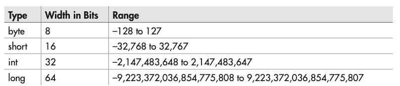

# Chapter 2 Introducing Data Types and Operators

Data types are especially important in Java because it is a strongly typed language.

This means
that all operations are type-checked by the compiler for type compatibility.
Thus, strong type checking helps prevent errors and enhances reliability.

## Java's Primitive Types


The term primitive is used here to indicate
that these types are not objects in an object-oriented sense, but rather, normal binary values.
Although strictly specifying the range of the primitive types may cause a small loss
of performance in some environments, it is necessary in order to achieve portability.

### Intergers



As the table shows, all of the integer types are signed positive and negative values. Java
does not support unsigned (positive-only) integers.

Clearly, the result could not have been held in an int variable.
The smallest integer type is byte. Variables of type byte are especially useful when working
with raw binary data that may not be directly compatible with Java’s other built-in types.

### Floating-point Types

The floating-point types can represent numbers that have fractional
components. There are two kinds of floating-point types, float and double, which represent
single- and double-precision numbers, respectively.

Of the two, double is the most commonly used because all of the math functions in Java’s
class library use double values.

One other point about the preceding example: As mentioned, sqrt( ) is a member of the
standard Math class. Notice how sqrt( ) is called; it is preceded by the name Math. This is
similar to the way System.out precedes println( ). Although not all standard methods are
called by specifying their class name first, several are.

### Characters
In Java, characters are not 8-bit quantities like they are in many other computer languages.
Instead, Java uses Unicode.

In Java, char is an unsigned 16-bit type having a
range of 0 to 65,536. 

```java
class CharArithDemo {
    public static void main(String[] args) {
        char ch;

        ch = 'X';
        System.out.println(ch);

        ch++;
        System.out.println(ch);
    }
}
```


Why does Java use Unicode?

Java was designed for worldwide use. Thus, it needs to use a character set that can represent
all the world’s languages.

### The Boolean Type

```java
class BoolDemo {
    public static void main(String[] args) {
        boolean a = true;

        if(a) {
            System.out.println("true");
        } else {
            System.out.println("false");
        }
    }
}
```


### Sound.java
```java
class Sound {
    public static void main(String[] args) {
        double dist;

        dist = 7.2 * 1100;

        System.out.println(dist);
    }
}
```


### Literal
In Java, literals refer to fixed values that are represented in their human-readable form. For
example, the number 100 is a literal.

Literals are also commonly called constants.

Java literals can be of any of the primitive data types. The way each literal is represented
depends upon its type. 

Integer literals are specified as numbers without fractional components.

11.123 is a floating-point literal.

By default, integer literals are of type int. If you want to specify a long literal, append an
l or an L. For example, 12 is an int, but 12L is a long.
By default, floating-point literals are of type double. To specify a float literal, append an
F or f to the constant. For example, 10.19F is of type float.

Beginning with JDK 7, you can embed one or more underscores into an integer or floating-
point literal. Doing so can make it easier to read values consisting of many digits. When the
literal is compiled, the underscores are simply discarded. Here is an example:
123_45_1234

```java
class UnderScore {
    public static void main(String[] args) {
        int a = 1_000_100_100;

        System.out.println(a);
    }
}
```

### Hexadecimal, Octal, and Binary Literals

Beginning with JDK 7, it is possible to specify an integer literal by use of binary. To do so,
precede the binary number with a 0b or 0B. For example, this specifies the value 12 in binary:
0b1100.

### Character Escape Sequence


### String Literals
A string is a set of characters enclosed by
double quotes.

```java
class StrDemo {
    public static void main(String[] args) {
        System.out.println("A\tB\tC\tD\tE\tF\tG\tH");
    }
}
```


### Close Look at Variables
The type of a
variable cannot change during its lifetime. An int variable cannot turn into a char variable, for
example.

### Initializing a Variable
In general, you must give a variable a value prior to using it. One way to give a variable a value
is through an assignment statement, as you have already seen. Another way is by giving it an
initial value when it is declared.


### The Scope and Lifetime of Variables
For now, we will examine only the scopes defined by or within a method.
The scope defined by a method begins with its opening curly brace. However, if that method
has parameters, they too are included within the method’s scope.

As a general rule, variables declared inside a scope are not visible (that is, accessible) to
code that is defined outside that scope. Thus, when you declare a variable within a scope, you
are localizing that variable and protecting it from unauthorized access and/or modification.

This means
that objects declared in the outer scope will be visible to code within the inner scope. However,
the reverse is not true. Objects declared within the inner scope will not be visible outside it.

```java
class ScopeDemo {
    public static void main(String[] args) {
        int x;

        x = 10;
        if(x == 10) {
            int y = 20;

            System.out.println(x + " " + y);
            x = y * 2;
        }
//        y = 100; Error
        System.out.println(x);
    }
}
```

Within a block, variables can be declared at any point, but are valid only after they are
declared. Thus, if you define a variable at the start of a method, it is available to all of the code
within that method. Conversely, if you declare a variable at the end of a block, it is effectively
useless, because no code will have access to it.

Here is another important point to remember: variables are created when their scope is
entered, and destroyed when their scope is left. This means that a variable will not hold its
value once it has gone out of scope. Therefore, variables declared within a method will not
hold their values between calls to that method.

```java
class VarInitDemo {
    public static void main(String[] args) {
        int x;
        for(x = 0; x < 3; x++) {
            int y = -1;
            System.out.println("y = " + y);

            y = 100;
            System.out.println("y = " + y);
        }
    }
}
```
Thus, the lifetime of a variable is `confined` to its scope.
If a variable declaration includes an initializer, that variable will be reinitialized each time
the block in which it is declared is entered.

There is one `quirk` to Java’s scope rules that may surprise you: although blocks can be
nested, no variable declared within an inner scope can have the same name as a variable
declared by an enclosing scope.

```java
class NestVar {
    public static void main(String[] args) {
        int count;

        for(count = 0; count < 10; count++) {
            System.out.println(count);

            int count;
            for(count = 0; count < 10; count++) {
                System.out.println(count);
            }
        }
    }
}
```

### Operators
Java provides a rich operator environment. An operator is a symbol that tells the compiler
to perform a specific mathematical or logical manipulation. Java has four general classes
of operators: arithmetic, bitwise, relational, and logical.

Java also defines some additional
operators that handle certain special situations. 

### Arithmetic Operators


First, remember that when / is applied to an integer, any
remainder will be truncated.
You can obtain
the remainder of this division by using the modulus operator %.

10 % 3 is 1.
In Java, the % can be applied to both integer and floating-point types. 

### Increment and Decrement
In this case, y will be set to 11. However, if the code is written as
x = 10;
y = x++;
then y will be set to 10. In both cases, x is still set to 11; the difference is when it happens.
There are significant advantages in being able to control when the increment or decrement
operation takes place.

### Relational and Logical Operators
In the terms relational operator and logical operator, relational refers to the relationships that
values can have with one another, and logical refers to the ways in which true and false values
can be connected together.

Since the relational operators produce true or false results, they
often work with the logical operators.


The outcome of the relational and logical operators is a `boolean value`.

In Java, all objects can be compared for equality or inequality using = = and !=. However,
the comparison operators, <, >, <=, or >=, can be applied only to those types that support an
ordering relationship.

### Short-Circuit Logical Operators
In an AND
operation, if the first operand is false, the outcome is false no matter what value the second
operand has. 

In an OR operation, if the first operand is true, the outcome of the operation is
true no matter what the value of the second operand. 

To prevent a divide-by-zero, the if statement first checks to see if d is equal to zero. If it is,
the short-circuit AND stops at that point and does not perform the modulus division.
```java
class SCops {
    public static void main(String[] args) {
        int n, d, q;

        n = 10;
        d = 2;

        if(d != 0 && (n % d) == 0) {
            System.out.println(d + " is a factor of " + n);
        }

        d = 0;

        if(d != 0 && (n % d) == 0) {
            System.out.println(d + " is a factor of " + n);
        }

        if(d != 0 & (n % d) == 0) {
            System.out.println(d + " is a factor of " + n);
        }
    }
}
```

### Type Conversion in Assignments
However, because of Java’s strict type checking,
not all types are compatible, and thus, not all type conversions are implicitly allowed. For
example, boolean and int are not compatible.

When one type of data is assigned to another type of variable, an automatic type
conversion will take place if
- The two types are compatible.
- The destination type is larger than the source type.

For widening conversions, the numeric types, including integer and floating-point types,
are compatible with each other. For example, the following program is perfectly valid since
long to double is a widening conversion that is automatically performed.

```java
class LtoD {
   public static void main(String[] args) {
      long L;
      double D;

      L = 100123285L;
      D = L;

      System.out.println("L and D: " + L + " " + D);
   }
}
```


Although there is an automatic conversion from long to double, there is no automatic
conversion from double to long, since this is not a widening conversion. Thus, the following
version of the preceding program is invalid.

```java
public class DtoL {
   public static void main(String[] args) {
      long L;
      double D;

      D = 100123285.0;
      L = D; // Illegal!!!

      System.out.println("L and D : " + L + " " + D);
   }
}
```

### Casting Incompatible Types
>(target-type) expression

```java
double x, y;
// ...
(int) (x / y)
```
The parentheses surrounding x / y are necessary. 

When a cast involves a narrowing conversion, information might be lost. For example,
when casting a long into a short, information will be lost if the long’s value is greater than the
range of a short because its high-order bits are removed. 

### Operator Precedence


### Display a Truth Table for the Logical Operators
```java
public class LogicalOpTable {
   public static void main(String[] args) {
      System.out.println("P\tQ\tAND\tOR\tXOR\tNOT");

      int p, q;
      p = 0; q = 0;
      System.out.println(p + "\t" + q + "\t" + (p & q) + 
         "\t" + (p | q) + "\t" + (p ^ q) + "\t" + !(p == 1)
      );

      p = 0; q = 1;
      System.out.println(p + "\t" + q + "\t" + (p & q) + 
         "\t" + (p | q) + "\t" + (p ^ q) + "\t" + !(p == 1)
      );

      p = 1; q = 0;
      System.out.println(p + "\t" + q + "\t" + (p & q) + 
         "\t" + (p | q) + "\t" + (p ^ q) + "\t" + !(p == 1)
      );

      p = 1; q = 1;
      System.out.println(p + "\t" + q + "\t" + (p & q) + 
         "\t" + (p | q) + "\t" + (p ^ q) + "\t" + !(p == 1)
      );

   }
}
```


Chapter 2 Self Test
1. 플랫폼 독립성 보장을 통한 일관된 결과 제공
2. 문자를 저장하기 위한 공간, 유니코드로 2바이트
3. boolean 값은 false또는 true만 갖는다. 숫자 불가
4. 
```java
public class Ex4 {
   public static void main(String[] args) {
      System.out.println("One\nTwo\nThree");
   }
}
```
1. 
```java
for(i = 0; i < 10; i++) {
    int sum;
    sum = sum + i;
}
System.out.println("Sum is: " + sum);
```

i의 미선언, sum의 미 초기화 및 블록스코프 문제가 있음

6. postfix는 문이 종료된 후 연산 진행 prefix는 표현식 평가 당시 값이 증가한 후 다른 연산 진행
7.  
```java
if(a != 0 && b / a == 0) {
    //...
}
```
8. to int
9. compatible하지 않을 때, 연산 결과 값이 할당할 변수보다 서열이 높을 때
10.  
```java
public class Ex10 {
   public static void main(String[] args) {
      System.out.println("Prime number : ");
      for(int i = 2; i <= 100; i++) {
         boolean isPrime = true;

         for(int j = 2; j < i; j++) {
            if(i % j == 0) {
               isPrime = false;
               break;
            }
         }

         if(isPrime) System.out.println(i);
      }
   }
}
```

11. no effect
12. yee