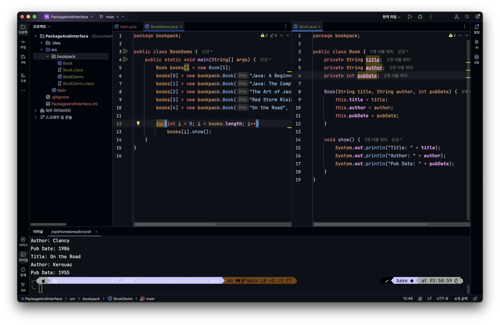
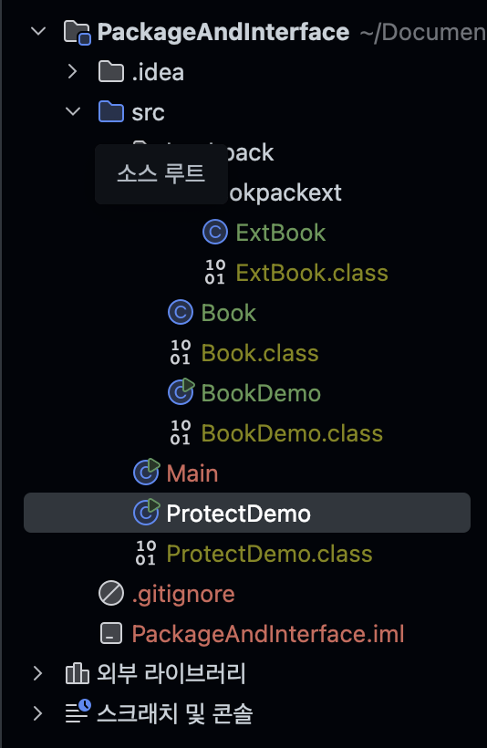

# 챕터 8 패키지와 인터페이스

## 패키지
패키지는 서로 관련된 클래스들을 그룹화 하는 기능을 제공하는 것이다. 패키지를 사용하면 코드의 체계적인 정리가 가능하고, 캡슐화가 가능하다.

## 패키지의 목적
1. 코드의 조직화 : 관련된 클래스를 `하나의 단위로 구성하며` 체계적으로 관리할 수 있다.
2. 접근제어 : `패키지 내부의 클래스들은 외부에서 접근할 수 없도록` 설정할 수 있어 캡슐화가 강화된다.

## 네임스페이스(namespace)와 충돌 방지
1. 자바에서는 클래스의 이름이 네임스페이스에서 유일해야한다.
2. 프로그램의 규모가 커지면 중복된 이름의 클래스 이름 충돌이 발생할 수 밖에 없음.
3. 이를 방지하기 위해 서로 다른 패키지에서 동일한 이름의 클래스를 사용할 수 있도록 패키지를 사용함.

## 패키지 정의 방법
```java
package mypackage;
```

1. 자바에서는 패키지를 디렉토리 구조로 관리한다.
2. mypackage를 사용라면 해당 디렉토리에 클래스 파일이 위치해야한다.
3. 일반적으로 소문자를 사용하는 것이 컨벤션임.
4. `.`을 사용하여 하위 패키지를 생성할 수 있음.

```java
package alpha.beta.gamma;
```

>위 패키지의 경우 alpha/beta/gamma 디렉토리 구조로 저장해야한다.

## 자바 런타임 시스템이 패키지를 찾는 방법
1. 현재 작업 디렉토리를 기본 경로로 사용한다.
2. CLASSPATH 환경 변수를 설정하여 패키지의 경로를 지정한다.
3. java 및 javac 명령어의 --classpath 옵션을 사용해 패키지 경로를 명시한다.

### 예시
```java
package mypack;
```

위 경우 다음 중 하나의 조건이 충족되어야 한다.
1. mypack 폴더가 현재 디렉토리 아래에 있어야 한다.
2. CLASSPATH 환경 변수가 해당 경로를 포함해야 한다.
3. --classpath옵션을 사용하여 실행 시 경로를 지정해야 한다.

```java
package bookpack;

class Book {
    private String title;
    private String author;
    private int pubDate;

    Book(String title, String author, int pubDate) {
        this.title = title;
        this.author = author;
        this.pubDate = pubDate;
    }

    void show() {
        System.out.println("Title: " + title);
        System.out.println("Author: " + author);
        System.out.println("Pub Date: " + pubDate);
    }
}

public class BookDemo {
    public static void main(String[] args) {
        Book books[] = new Book[5];
        books[0] = new Book("Java: A Beginner's Guide", "Schildt", 2014);
        books[1] = new Book("Java: The Complete Reference", "Schildt", 2014);
        books[2] = new Book("The Art of Java", "Schildt and Holmes", 2003);
        books[3] = new Book("Red Storm Rising", "Clancy", 1986);
        books[4] = new Book("On the Road", "Kerouac", 1955);

        for(int i = 0; i < books.length; i++)
            books[i].show();
    }
}
```

```bash
$ javac bookpack/BookDemo.java
$ java bookpack.BookDemo
```

> 자바 클래스 파일을 생성하는 명령어 javac는 bookpack이 있는 디렉토리에서 실행되어야 한다.
> 실행시 `.`을 사용해서 패키지 디렉토리 구조를 나타낸다.


## 패키지와 멤버 접근 권한
패키지로 묶여있는 클래스들 간에 정교한 접근제어를 정의할 수 있다. 즉 클래스의 접근제어가 가능하다.

접근 제어자	동일 클래스	동일 패키지	하위 클래스(다른 패키지)	외부 클래스(다른 패키지)


private	O	X	X	X
(기본)	O	O	X	X
protected	O	O	O	X
public	O	O	O	O

## 클래스의 접근 제어를 통해 패키지내에 있는 클래스 사용하기



> Book class는 bookpack패키지로 선언된 크래스이고 public이므로 패키지 경로를 나타내어 다른 클래스에서 사용할 수 있음.


## 패키지 내부 패키지 선언하기

실습에서 진행한 디랙토리 구조는 bookpack.bookpackext 구조이며 bookpack내부에 Book.class가 있고 bookpack.bookpackext 내부에는 ExtBook.class가 있다. 링킹하여 실행하는 class는 src경로에 있다.



```java
package bookpack.bookpackext;

public class ExtBook extends bookpack.Book {
    private String publisher;

    public ExtBook(String t, String a, int d, String p) {
        super(t, a, d);
        publisher = p;
    }

    public void show() {
        super.show();
        System.out.println(publisher);
        System.out.println();
    }

    public String getPublisher() { return publisher; }
    public void setPublisher(String p) { this.publisher = p; }

    public String getTitle() { return title; }
    public void setTitle(String t) { title = t; }
    public String getAuthor() { return author; }
    public void setAuthor(String a) { author = a; }
    public int getPubDate() { return pubDate; }
    public void setPubDate(int p) { pubDate = p; }
}
```

1. 상위 디렉토리에 있는 클래스를 참조하는 부분을 확인해보면 `bookpack.Book` 으로 참조한 것을 확인 할 수 있다.

2. Book 클래스에서는 각 필드들을 `protected`로 접근제한 하여 `Book`클래스를 상속받은 `ExtBook`에서 상속받은 클래스의 필드들을 접근할 수 있다.

3. `Book`클래스의 생성자 함수나 오버라이딩을 위한 super클래스의 메서드 호출 등을 위해서는 `Book`클래스 내부 `contructor`나 `show`메서드는 `public`접근 제한이어야 한다.

## import문을 통해서 패키지 쉽게 접근하기

```java
public class ExtBook extends bookpack.Book {
```

위 처럼 클래스를 가져오기 위해서 패키지를 명시했지만

```java
import bookpack.*;
public class ExtBook extends Book 
```

`import`를 통해 `bookpack`의 클래스를 모두 가져올 수 있다.

## Java API와 패키지 구조
- java.lang	기본 클래스(문자열, 수학 연산 등)
- java.io	입출력 관련 클래스 (파일, 스트림 등)
- java.net	네트워킹 기능 (소켓, HTTP 등)
- java.util	유틸리티 기능 (컬렉션, 날짜 처리 등)

> java.lang 패키지는 자동으로 import됨

## interface의 개념
자바의 인터페이스는 클래스가 무엇을 해야하는지 정의하지만 어떻게 해야 하는지는 정의하지 않는 추상적인 개념이다.

## 인터페이스의 기본 형식
```java
public interface 인터페이스이름 {
    반환타입 메서드이름(매개변수);
    void reset();
}
```
> c++의 abstract class?

## 클래스 정의의 일반적인 형태
```java
class 클래스이름 extends 슈퍼클래스 implements 인터페이스 {
// 클래스 내용
}
```

## 인터페이스 구현 실습
Series.java
```java
public interface Series {
    int getNext();
    void reset();
    void setStart(int x);
}
```

ByTwos
```java
class ByTwos implements Series {
    int start;
    int val;

    ByTwos(){
        start = 0;
        val = 0;
    }

    public int getNext() {
        val += 2;
        return val;
    }

    public void reset() {
        val = start;
    }

    public void setStart(int x) {
        start = x;
        val = x;
    }
}
```

> interface의 method를 구현할 때는 반드시 public 접근 제어자를 사용해야한다. interface의 모든 메서드는 기본적으로 public이기 때문이다.

```java
class ByTwos implements Series {
    int start;
    int val;
    int prev;

    ByTwos() {
        start = 0;
        val = 0;
        prev = -2;
    }

    public int getNext() {
        prev = val;
        val += 2;
        return val;
    }

    public void reset() {
        val = start;
        prev = start - 2;
    }

    public void setStart(int x) {
        start = x;
        val = x;
        prev = x - 2;
    }

    public int getPrevious() {
        return prev;
    }
}
```

> interface에 없는 getPrevious도 추가적으로 정의 할 수 있다.

## 인터페이스 변수의 특징
1. 어디서든 접근이 가능하다
2. 상수이다
3. 구현하지 않고도 interface이름을 통해 접근이 가능하다.

```java
interface IConst {
   int MIN = 0;
   int MAX = 10;
   String ERRORMSG = "Boundary Error";
}
```

## 인터페이스 확장
인터페이스 구현이 아닌 추상적인 부분을 상속받아 인터페이스를 생성할 수 있다.

```java
interface A {
   void method1();
   void method2();
}

interface B extends A {
   void method3();
}

class MyClass implements B {
   //...
}
```

> 인터페이스 구현 클래스는 상속된 모든 인터페이스의 메서드를 반드시 구현해야 한다.

## default interface methods(JDK 8 이후)


JDK 8 이전의 interface는 철저히 추상 메서드만 정의할 수 있었다. JDK 8 이후 default 키워드를 사용하여 메서드 구현이 가능해졌다.

```java
public interface MyIF {
    int getUserID();  // 일반적인 인터페이스 메서드 (추상 메서드)

    // 디폴트 메서드 (구현 포함)
    default int getAdminID() {
        return 1;
    }
}
```

> 위 default interface methods를 통해 인터페이스를 선언할 때 구현이 이미 된 메서드를 추가할 수 있다.


## 인터페이스의 정적 메서드
```java
public interface MyIF {
    static int getUniversalID() {
        return 0;
    }
}
```

이는 인터페이스 이름을 통해 접근 가능한 정적 메서드이며, 인터페이스 상속 또는 구현 시 상속되지 않는다.

## 인터페이스의 실전 활용
1. 다형성 제공 : 동일한 인터페이스를 구현하는 다양한 클래스 만들 수 있음
2. 코드 분리 및 확장성 : 구현을 숨기고, 유지보수를 용이하게 할 수 있음
3. 특정 동작 강제 : 인터페이스를 통해 일관된 기능을 구현하도록 강제할 수 있음.
   