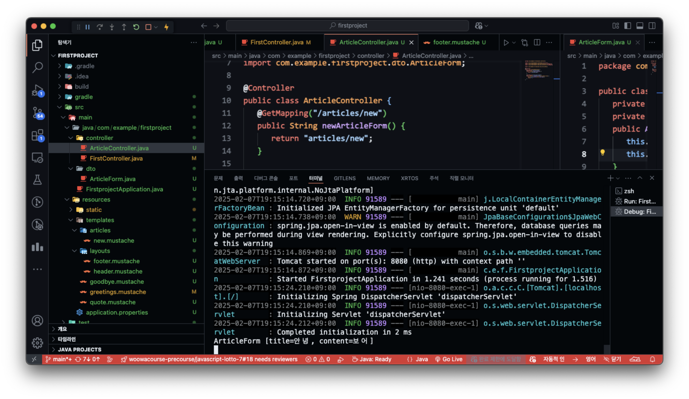
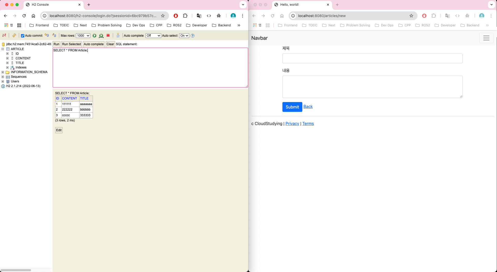

# 3장




## form 관련

- 폼 데이터 : <form>에서 입력한 데이터
- action : 어디로 폼 데이터를 보낼 것 인가
- method : 어떤 방식으로 보낼 것인가

```html
<form class="container" action="/articles/create" method="post">
```

각 input의 name은 필드명으로 해야함
```html
<input type="text" class="form-control" name="title">
...
<textarea class="form-control" rows="3" name="content"></textarea>
```

## DTO(Date Transfer Object)

### 폼 데이터를 DB에 저장하는 과정
1. 폼 데이터를 DTO객체에 담는다.
2. DTO 객체를 Entity로 변환한다.
3. Repository를 통해서 Entity를 DB에 저장한다.

## Autowired Annotation
의존성 주입(DI)을 하는 과정으로 외부에서 만들어진 객체를 필요한 곳으로 가져오는 기법이다.

## 3장에서의 전 과정 정리
1. 입력 폼 만들기
```html
{{>layouts/header}}

<form class="container" action="/articles/create" method="post">
    <div class="mb-3">
        <label class="form-label">제목</label>
        <input type="text" class="form-control" name="title">
    </div>
    <div class="mb-3">
        <label class="form-label">내용</label>
        <textarea class="form-control" rows="3" name="content"></textarea>
    </div>
    <button type="submit" class="btn btn-primary">Submit</button>
    <a href="/articles">Back</a>
</form>

{{>layouts/footer}}
```

2. 컨트롤러 만들기
```java
package com.example.firstproject.controller;


import com.example.firstproject.repository.ArticleRepository;
import org.springframework.beans.factory.annotation.Autowired;
import org.springframework.stereotype.Controller;
import org.springframework.web.bind.annotation.GetMapping;
import org.springframework.web.bind.annotation.PostMapping;

import com.example.firstproject.dto.ArticleForm;
import com.example.firstproject.entity.Article;

@Controller
public class ArticleController {
   @Autowired
   private ArticleRepository articleRepository;

   @GetMapping("/articles/new")
   public String newArticleForm() {
      return "articles/new";
   }

   @PostMapping("/articles/create")
   public String createArticles(ArticleForm form) {
      System.out.println(form.toString());
      Article article = form.toEntity(); // entity 변환

      System.out.println(article.toString());
      Article saved = articleRepository.save(article);
      /// repository를 이용해 db에 저장¡한 뒤 saved객체 반환함
      System.out.println(saved.toString());

      return "";
   }
}

```

맵핑을 먼저 했다고 가정한다.

3. DTO 만들기(ArticleForm)
```java
package com.example.firstproject.dto;

import com.example.firstproject.entity.Article;

public class ArticleForm {
   private String title;
   private String content;

   public ArticleForm(String title, String content) {
      this.title = title;
      this.content = content;
   }

   @Override
   public String toString() {
      return "ArticleForm{" + 
      "title='" + title + '\'' + 
      ", content='" + content + '\'' + 
      '}';
   }

    public Article toEntity() {
      return new Article(null, title, content);
    }
}

```

후에 Article 인터페이스를 정의한 뒤 toEntity 메서드를 구현한다.

4. 입력 폼과 DTO 연결하기
   컨트롤러에서 매개변수로 ArticleForm 객체를 받음


5. com.example.firstproject.entity에는 Article interface를 정의함
```java
package com.example.firstproject.entity;

import jakarta.persistence.Column;
import jakarta.persistence.Entity;
import jakarta.persistence.GeneratedValue;
import jakarta.persistence.Id;

@Entity
public class Article {
    @Id
    @GeneratedValue
    private Long id;
    @Column
    private String title;
    @Column
    private String content;

    public Article(Long id, String title, String content) {
        this.id = id;
        this.title = title;
        this.content = content;
    }
    @Override
    public String toString() {
        return "Article{" + "id=" + id +
        ", title='" + title + '\'' +
        ", content='" + content + '\'' +
        '}';
    }
}

```

위 Article interface는 controller에서 @Autowired를 이용해 DI함

6. ArticleForm DTO의 toEntity() 메서드가 Article인터페이스를 이용하여 Article 객체를 반환하도록 구현함
```java
public Article toEntity() {
  return new Article(null, title, content);
}
```


7. ArticleRepository를 정의한다
   1. ArticleRepository는 CrudRepository<T, ID>를 상속받는다.
   2. <Article, Long>으로 지정함     

```java
package com.example.firstproject.repository;

import com.example.firstproject.entity.Article;
import org.springframework.data.repository.CrudRepository;

public interface ArticleRepository extends CrudRepository<Article, Long> {

}
```

얘네가 대신 수행하는 메서드가 이미 정의되어 있다고 생각하면 됨

8. DB 접속 방법

   1. `application.properties`에서 spring.h2.console.enabled=true로 설정한다.
   2.  localhost:8080/h2-console 에 접속하여 connect를 수행한다.
   3. Run시 출력결과에서 jdbc:h2:mem 이 포함된 주소를 복사하여 JDBC URL에 붙여넣기 한다.
   4. connect 하여 데이터베이스에 접근한다.
  
9. SQL문으로 테이블에 CRUD를 해본다.


핵심내용
