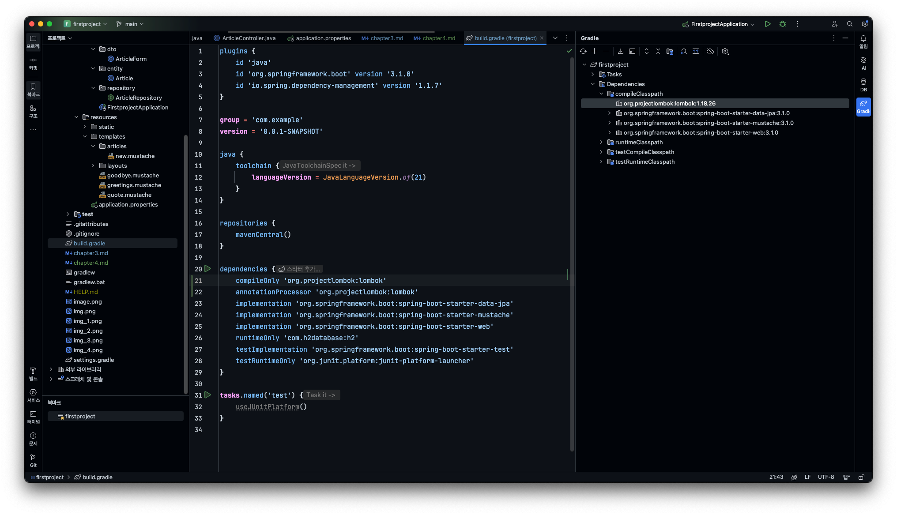
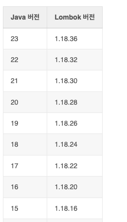
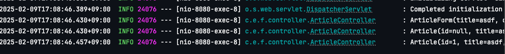

# chapter 4 롬복과 리팩터링
롬복이란 코드를 간소화해 주는 라이브러리이다. 게터나 세터, 컨스트럭터 같은 필수 메서드들을 매번 작성하는 것이 번거로워 이러한 반복을 없애기 위해 만들어진 도구가 롬복이다.

또한 롬복의 로깅기능을 통해 프로그램의 수행 과정을 기록으로 남길 수도 있다.



## java버전에 따른 lombok버전


## @AllArgsConstructor 어노테이션을 통해 모든 Arg에 대한 생성자 함수 추가하기
```java
package com.example.firstproject.dto;

import com.example.firstproject.entity.Article;
import lombok.AllArgsConstructor;
import lombok.ToString;

@AllArgsConstructor
@ToString
public class ArticleForm {
   private String title;
   private String content;

    public Article toEntity() {
      return new Article(null, title, content);
    }
}
```

## @ToString annotation을 통해 ToString메서드 생성하기
```java
package com.example.firstproject.dto;

import com.example.firstproject.entity.Article;
import lombok.AllArgsConstructor;
import lombok.ToString;

@AllArgsConstructor
@ToString
public class ArticleForm {
   private String title;
   private String content;

    public Article toEntity() {
      return new Article(null, title, content);
    }
}
```

## @Slf4j 어노테이션을 통해 println 대신 로깅하기
```java
package com.example.firstproject.controller;


import com.example.firstproject.repository.ArticleRepository;
import lombok.extern.slf4j.Slf4j;
import org.springframework.beans.factory.annotation.Autowired;
import org.springframework.stereotype.Controller;
import org.springframework.web.bind.annotation.GetMapping;
import org.springframework.web.bind.annotation.PostMapping;

import com.example.firstproject.dto.ArticleForm;
import com.example.firstproject.entity.Article;

@Slf4j
@Controller
public class ArticleController {
   @Autowired
   private ArticleRepository articleRepository;

   @GetMapping("/articles/new")
   public String newArticleForm() {
      return "articles/new";
   }

   @PostMapping("/articles/create")
   public String createArticles(ArticleForm form) {
      log.info(form.toString());
//      System.out.println(form.toString());
      Article article = form.toEntity(); // entity 변환

      log.info(article.toString());
//      System.out.println(article.toString());
      Article saved = articleRepository.save(article);
      /// repository를 이용해 db에 저장¡한 뒤 saved객체 반환함

      log.info(saved.toString());
//      System.out.println(saved.toString());

      return "";
   }
}
```

1. @Slf4j 어노테이션 추가
2. log.info()에 원하는 로깅 정보 삽입





## 셀프 체크

### 컨트롤러 롬복 리팩터링
```java
package com.example.firstproject.controller;

import com.example.firstproject.dto.MemberForm;
import com.example.firstproject.entity.Member;
import com.example.firstproject.repository.MemberRepository;
import lombok.extern.slf4j.Slf4j;
import org.springframework.beans.factory.annotation.Autowired;
import org.springframework.stereotype.Controller;
import org.springframework.web.bind.annotation.GetMapping;
import org.springframework.web.bind.annotation.PostMapping;

@Slf4j
@Controller
public class MemberController {
    @Autowired
    private MemberRepository memberRepository;

    @GetMapping("signup")
    public String signup() {
        return "members/new";
    }

    @PostMapping("/join")
    public String signup(MemberForm form) {
        log.info(form.toString());
        Member member = form.toEntity();

        log.info(member.toString());

        Member saved = memberRepository.save(member);

        log.info(saved.toString());

        return "";
    }
}

```

### DTO 롬복 리팩터링
```java
package com.example.firstproject.entity;

import jakarta.persistence.Column;
import jakarta.persistence.Entity;
import jakarta.persistence.GeneratedValue;
import jakarta.persistence.Id;
import lombok.AllArgsConstructor;
import lombok.ToString;

@AllArgsConstructor
@ToString
@Entity
public class Member {
    @Id
    @GeneratedValue
    private Long id;
    @Column
    private String email;
    @Column
    private String password;
}

```

