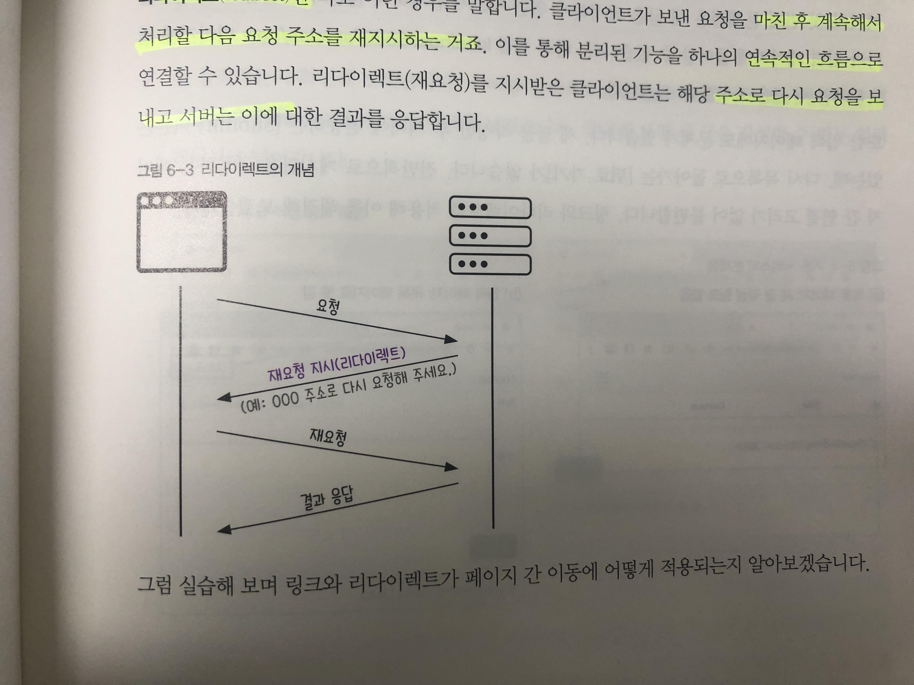

# Chapter 6
## 리다이렉트
클라이언트가 보낸 요청을 마친 후 계속해서 처리할 다음 요청 주소를 재지시 하는 것이다.



## 새 글 작성 시 작성한 게시글의 상세페이지로 이동하기
```java
    @PostMapping("/articles/create")
    public String createArticles(ArticleForm form) {
      System.out.println(form.toString());
      Article article = form.toEntity(); // entity 변환

      System.out.println(article.toString());
      Article saved = articleRepository.save(article);
      /// repository를 이용해 db에 저장¡한 뒤 saved객체 반환함
      System.out.println(saved.toString());

      return "redirect:/articles/" + saved.getId();
    }
```

> return 하는 문자열을 redirect:/articles/id로 수정해준다.
> 당연히 Article 클래스에서 getId메서드를 구현해야 한다.

```java
@AllArgsConstructor
@NoArgsConstructor
@ToString
@Entity
@Getter
public class Article {
    @Id
    @GeneratedValue
    private Long id;
    @Column
    private String title;
    @Column
    private String content;

//    Long getId() {
//        return id;
//    }
}
```

@Getter 어노테이션을 붙이거나 getId를 구현한다. 

## 게시글 작성페이지의 뒤로가기 구현하기
```html
{{>layouts/header}}

<form class="container" action="/articles/create" method="post">
    <div class="mb-3">
        <label class="form-label">제목</label>
        <input type="text" class="form-control" name="title">
    </div>
    <div class="mb-3">
        <label class="form-label">내용</label>
        <textarea class="form-control" rows="3" name="content"></textarea>
    </div>
    <button type="submit" class="btn btn-primary">Submit</button>
    <a href="/articles">Back</a>
</form>

{{>layouts/footer}}
```

