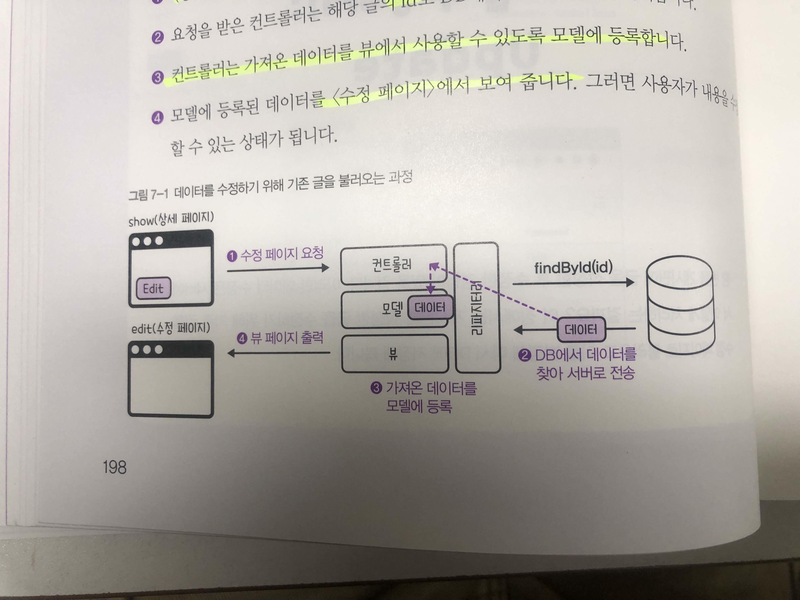
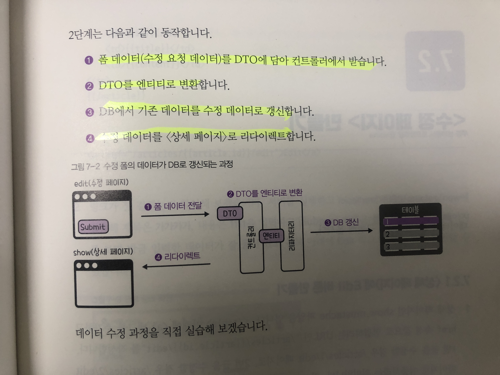

# Chapter7 게시글 수정하기

## 과정
1. 수정 페이지를 만들고 기존의 데이터를 DB에서 불러와 뷰를 작성한다.
    a. 상세페이지에서 Edit버튼을 누른다
    b. 요청 받은 컨트롤러는 해당 글의 id로 DB에서 데이터를 불러온다.
    c. 가져온 데이터를 뷰에서 사용할 수 있도록 모델에 등록한뒤 수정페이지에서 보여준다.

2. 수정된 데이터를 DB에 기록한다.
    a. 폼 데이터를 DTO에 담아 컨트롤러에서 받는다.
    b. DTO를 엔티티로 변환하여 레파지토리를 이용하여 DB데이터를 수정한다.
    c. 수정 데이터를 상세페이지로 리다이렉트한다.

