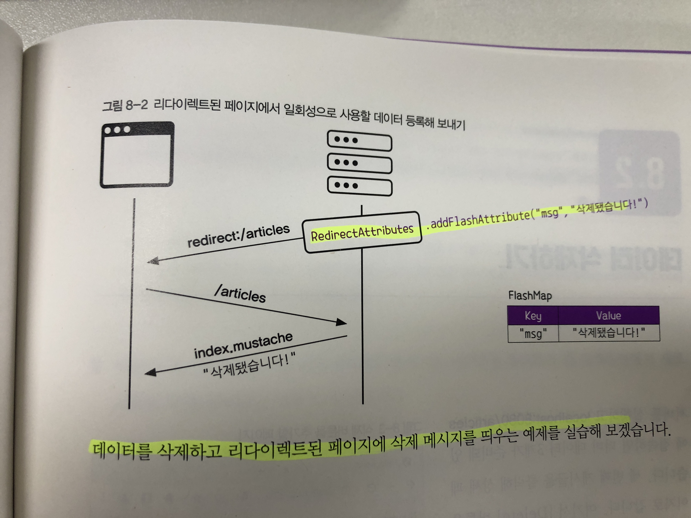

# chapter8 게시글 삭제하기(Delete)

## 1. 게시글 삭제 과정
1. HTTP 메서드로 특정 게시글의 삭제를 요청합니다.
2. DB에 저장된 데이터를 찾아 삭제한다.
3. 삭제가 완료되었다면 리다이렉트함

## 2. 삭제가 완료되었을 때 잠깐 동안 사용할 일회성 데이터를 전달하기
```java
RedirectAttributes rtts;

...

rtts.addFlashAttribute();
```

> 일회성 데이터 등록하는 메서드

## 3. 도식화한 그림



## 4. delete 동작은 Get으로 Mapping한다.

```java
   @GetMapping("articles/{id}/delete")
   public String delete(@PathVariable Long id, RedirectAttributes rttr) {
      log.info("삭제 요청이 들어왔습니다!!");

      Article target = articleRepository.findById(id).orElse(null);
      log.info(target.toString());

      if(target != null) {
         articleRepository.delete(target);
         rttr.addFlashAttribute("msg", "삭제되었습니다!");
      }

      return "redirect:/articles";
   }
```

> DeleteMapping은 없다!

## 5. 삭제할 대상 가져오기
```java
    Article target = articleRepository.findById(id).orElse(null);
    log.info(target.toString());
```

## 6. 대상이 존재하는 경우 대상 삭제하기
```java
    Article target = articleRepository.findById(id).orElse(null);
    log.info(target.toString());
    
    
    if(target != null) {
        articleRepository.delete(target);    
    }
```

## 7. 삭제 메세지 잠깐 사용할 수 있도록 디라이렉트
```java
    if(target != null) {
        articleRepository.delete(target);
        rtts.addFlashAttributes("msg", "삭제되었습니다!");
    }
```

## 8. {{#msg}}를 통해 header.mustache에서 잠깐 사용하기
```html
    </nav>

    {{#msg}}
    <div class="alert alert-primary alert-dismissible">
        {{msg}}
        <button type="button" class="btn-close" data-bs-dismiss="alert"
                aria-label="Close"
        ></button>
    </div>
    {{/msg}}
```

