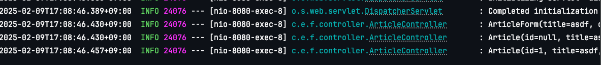

# 3장


## form 관련

- 폼 데이터 : <form>에서 입력한 데이터
- action : 어디로 폼 데이터를 보낼 것 인가
- method : 어떤 방식으로 보낼 것인가

```html
<form class="container" action="/articles/create" method="post">
```

각 input의 name은 필드명으로 해야함
```html
<input type="text" class="form-control" name="title">
...
<textarea class="form-control" rows="3" name="content"></textarea>
```

## DTO(Date Transfer Object)

### 폼 데이터를 DB에 저장하는 과정
1. 폼 데이터를 DTO객체에 담는다.
2. DTO 객체를 Entity로 변환한다.
3. Repository를 통해서 Entity를 DB에 저장한다.

## Autowired Annotation
의존성 주입(DI)을 하는 과정으로 외부에서 만들어진 객체를 필요한 곳으로 가져오는 기법이다.

## 3장에서의 전 과정 정리
1. 입력 폼 만들기
```html
{{>layouts/header}}

<form class="container" action="/articles/create" method="post">
    <div class="mb-3">
        <label class="form-label">제목</label>
        <input type="text" class="form-control" name="title">
    </div>
    <div class="mb-3">
        <label class="form-label">내용</label>
        <textarea class="form-control" rows="3" name="content"></textarea>
    </div>
    <button type="submit" class="btn btn-primary">Submit</button>
    <a href="/articles">Back</a>
</form>

{{>layouts/footer}}
```

2. 컨트롤러 만들기
```java
package com.example.firstproject.controller;


import com.example.firstproject.repository.ArticleRepository;
import org.springframework.beans.factory.annotation.Autowired;
import org.springframework.stereotype.Controller;
import org.springframework.web.bind.annotation.GetMapping;
import org.springframework.web.bind.annotation.PostMapping;

import com.example.firstproject.dto.ArticleForm;
import com.example.firstproject.entity.Article;

@Controller
public class ArticleController {
   @Autowired
   private ArticleRepository articleRepository;

   @GetMapping("/articles/new")
   public String newArticleForm() {
      return "articles/new";
   }

   @PostMapping("/articles/create")
   public String createArticles(ArticleForm form) {
      System.out.println(form.toString());
      Article article = form.toEntity(); // entity 변환

      System.out.println(article.toString());
      Article saved = articleRepository.save(article);
      /// repository를 이용해 db에 저장¡한 뒤 saved객체 반환함
      System.out.println(saved.toString());

      return "";
   }
}

```

맵핑을 먼저 했다고 가정한다.

3. DTO 만들기(ArticleForm)
```java
package com.example.firstproject.dto;

import com.example.firstproject.entity.Article;

public class ArticleForm {
   private String title;
   private String content;

   public ArticleForm(String title, String content) {
      this.title = title;
      this.content = content;
   }

   @Override
   public String toString() {
      return "ArticleForm{" + 
      "title='" + title + '\'' + 
      ", content='" + content + '\'' + 
      '}';
   }

    public Article toEntity() {
      return new Article(null, title, content);
    }
}

```

후에 Article 인터페이스를 정의한 뒤 toEntity 메서드를 구현한다.

4. 입력 폼과 DTO 연결하기
컨트롤러에서 매개변수로 ArticleForm 객체를 받음

5. com.example.firstproject.entity에는 Article interface를 정의함
```java
package com.example.firstproject.entity;

import jakarta.persistence.Column;
import jakarta.persistence.Entity;
import jakarta.persistence.GeneratedValue;
import jakarta.persistence.Id;

@Entity
public class Article {
    @Id
    @GeneratedValue
    private Long id;
    @Column
    private String title;
    @Column
    private String content;

    public Article(Long id, String title, String content) {
        this.id = id;
        this.title = title;
        this.content = content;
    }
    @Override
    public String toString() {
        return "Article{" + "id=" + id +
        ", title='" + title + '\'' +
        ", content='" + content + '\'' +
        '}';
    }
}

```

위 Article interface는 controller에서 @Autowired를 이용해 DI함

6. ArticleForm DTO의 toEntity() 메서드가 Article인터페이스를 이용하여 Article 객체를 반환하도록 구현함
```java
public Article toEntity() {
  return new Article(null, title, content);
}
```


7. ArticleRepository를 정의한다
   1. ArticleRepository는 CrudRepository<T, ID>를 상속받는다.
   2. <Article, Long>으로 지정함     
```java
package com.example.firstproject.repository;

import com.example.firstproject.entity.Article;
import org.springframework.data.repository.CrudRepository;

public interface ArticleRepository extends CrudRepository<Article, Long> {

}
```

얘네가 대신 수행하는 메서드가 이미 정의되어 있다고 생각하면 됨

8. DB 접속 방법
   1. `application.properties`에서 spring.h2.console.enabled=true로 설정한다.
   2.  localhost:8080/h2-console 에 접속하여 connect를 수행한다.
   3. Run시 출력결과에서 jdbc:h2:mem 이 포함된 주소를 복사하여 JDBC URL에 붙여넣기 한다.
   4. connect 하여 데이터베이스에 접근한다.
9. SQL문으로 테이블에 CRUD를 해본다.


핵심내용


# chapter 4 롬복과 리팩터링
롬복이란 코드를 간소화해 주는 라이브러리이다. 게터나 세터, 컨스트럭터 같은 필수 메서드들을 매번 작성하는 것이 번거로워 이러한 반복을 없애기 위해 만들어진 도구가 롬복이다.

또한 롬복의 로깅기능을 통해 프로그램의 수행 과정을 기록으로 남길 수도 있다.


## java버전에 따른 lombok버전


## @AllArgsConstructor 어노테이션을 통해 모든 Arg에 대한 생성자 함수 추가하기
```java
package com.example.firstproject.dto;

import com.example.firstproject.entity.Article;
import lombok.AllArgsConstructor;
import lombok.ToString;

@AllArgsConstructor
@ToString
public class ArticleForm {
   private String title;
   private String content;

    public Article toEntity() {
      return new Article(null, title, content);
    }
}
```

## @ToString annotation을 통해 ToString메서드 생성하기
```java
package com.example.firstproject.dto;

import com.example.firstproject.entity.Article;
import lombok.AllArgsConstructor;
import lombok.ToString;

@AllArgsConstructor
@ToString
public class ArticleForm {
   private String title;
   private String content;

    public Article toEntity() {
      return new Article(null, title, content);
    }
}
```

## @Slf4j 어노테이션을 통해 println 대신 로깅하기
```java
package com.example.firstproject.controller;


import com.example.firstproject.repository.ArticleRepository;
import lombok.extern.slf4j.Slf4j;
import org.springframework.beans.factory.annotation.Autowired;
import org.springframework.stereotype.Controller;
import org.springframework.web.bind.annotation.GetMapping;
import org.springframework.web.bind.annotation.PostMapping;

import com.example.firstproject.dto.ArticleForm;
import com.example.firstproject.entity.Article;

@Slf4j
@Controller
public class ArticleController {
   @Autowired
   private ArticleRepository articleRepository;

   @GetMapping("/articles/new")
   public String newArticleForm() {
      return "articles/new";
   }

   @PostMapping("/articles/create")
   public String createArticles(ArticleForm form) {
      log.info(form.toString());
//      System.out.println(form.toString());
      Article article = form.toEntity(); // entity 변환

      log.info(article.toString());
//      System.out.println(article.toString());
      Article saved = articleRepository.save(article);
      /// repository를 이용해 db에 저장¡한 뒤 saved객체 반환함

      log.info(saved.toString());
//      System.out.println(saved.toString());

      return "";
   }
}
```

1. @Slf4j 어노테이션 추가
2. log.info()에 원하는 로깅 정보 삽입





## 셀프 체크

### 컨트롤러 롬복 리팩터링
```java
package com.example.firstproject.controller;

import com.example.firstproject.dto.MemberForm;
import com.example.firstproject.entity.Member;
import com.example.firstproject.repository.MemberRepository;
import lombok.extern.slf4j.Slf4j;
import org.springframework.beans.factory.annotation.Autowired;
import org.springframework.stereotype.Controller;
import org.springframework.web.bind.annotation.GetMapping;
import org.springframework.web.bind.annotation.PostMapping;

@Slf4j
@Controller
public class MemberController {
    @Autowired
    private MemberRepository memberRepository;

    @GetMapping("signup")
    public String signup() {
        return "members/new";
    }

    @PostMapping("/join")
    public String signup(MemberForm form) {
        log.info(form.toString());
        Member member = form.toEntity();

        log.info(member.toString());

        Member saved = memberRepository.save(member);

        log.info(saved.toString());

        return "";
    }
}

```

### DTO 롬복 리팩터링
```java
package com.example.firstproject.entity;

import jakarta.persistence.Column;
import jakarta.persistence.Entity;
import jakarta.persistence.GeneratedValue;
import jakarta.persistence.Id;
import lombok.AllArgsConstructor;
import lombok.ToString;

@AllArgsConstructor
@ToString
@Entity
public class Member {
    @Id
    @GeneratedValue
    private Long id;
    @Column
    private String email;
    @Column
    private String password;
}

```

# 5장 게시글 읽기 Read

## 게시글 읽는 과정
1. 클라이언트로부터 Id값 같은 파라미터를 얻는다.
2. 해당 Id값을 이용하여 레파지토리를 통해 엔티티를 얻는다.
3. 엔티티로 모델에 값들을 입혀 뷰로 나타낸다.
   - 뷰로 나타낼 때는 모델의 이름을 mustache에 넣어서 값들 넣을 수 있다.

## 1. url요청 받기
```java
@GetMapping("/articles/{id}")
public String show(@PathVariable Long id, Model model) {
log.info("id : " + id);
//        1. id를 조회해 데이터 가져오기
//        2. 모델에 데이터 등록하기
//        3. 뷰 페이지 반환하기

//        Optional<Article> article = articleRepository.findById(id);
Article articleEntity = articleRepository.findById(id).orElse(null);

      model.addAttribute("article", articleEntity);

      return "articles/show";
}
```

> 매개변수에 @PathVariable annoatation을 이용하여 클라이언트가 요청한 id 파라미터 값을 얻을 수 있음

2. id를 이용하여 레파지토리를 통해 엔티티를 얻는다.
```java
Article articleEntity = articleRepository.findById(id).orElse(null);
```

> findById 메서드가 반환하는 값이 null일 수 있으므로 `orElse(null)`을 넣어 준다.

3. 엔티티로 모델에 값들을 입혀 뷰로 나타낸다.
```java
model.addAttribute("article", articleEntity);
```

> article을 통해 mustache에서 뷰를 작성함

4. 뷰 작성

```html
{{>layouts/header}}
<table class="table">
    <thead>
    <tr>
        <th scope="col">Id</th>
        <th scope="col">Title</th>
        <th scope="col">Content</th>
    </tr>
    </thead>
    <tbody>
        {{#article}}
        <tr>
            <th scope="row">{{id}}</th>
            <td colspan="2">{{title}}</td>
            <td>{{content}}</td>
        </tr>
        {{/article}}
    </tbody>
</table>
{{>layouts/footer}}
```

## 모든 데이터 가져오기
1. 레파지토리를 통해 모든 데이터를 엔티티로 변환함
2. 엔티티를 모델로 변환함
3. 뷰를 작성함

```java
@GetMapping("/articles")
   public String index(Model model) {
//      1. 모든 데이터 가져오기
//      2. 모델에 데이터 등록하기
//      3. 뷰 페이지 설정하기

      /// 다운 캐스팅을 통해 iterable객체를 List로 변환
//      List<Article> articleEntityList = (List<Article>)articleRepository.findAll();
//      Iterable<Article> articles = articleRepository.findAll();

      /// ArticleRepository에서 findAll메서드 overriding
      ArrayList<Article> articleEntityList = articleRepository.findAll();
      model.addAttribute("articleList", articleEntityList);

      return "articles/index";
```

> findAll() 메서드는 iterable객체를 반환하므로 형변환이 필요하다. 위 코드에서는 ArticleRepository에서 findAll 메서드를 overrideg하는 방식으로 해결하였다.

### mustache 작성
```html
{{>layouts/header}}
{{>layouts/header}}
<table class="table">
    <thead>
    <tr>
        <th scope="col">Id</th>
        <th scope="col">Title</th>
        <th scope="col">Content</th>
    </tr>
    </thead>
    <tbody>
    {{#articleList}}
        <tr>
            <th scope="row">{{id}}</th>
            <td colspan="2">{{title}}</td>
            <td>{{content}}</td>
        </tr>
    {{/articleList}}
    </tbody>
</table>
{{>layouts/footer}}
{{>layouts/footer}}
```

> 만약 ArrayList로 모델이 전달된 경우 해당 부분을 원소 수 만큼 반복한다.